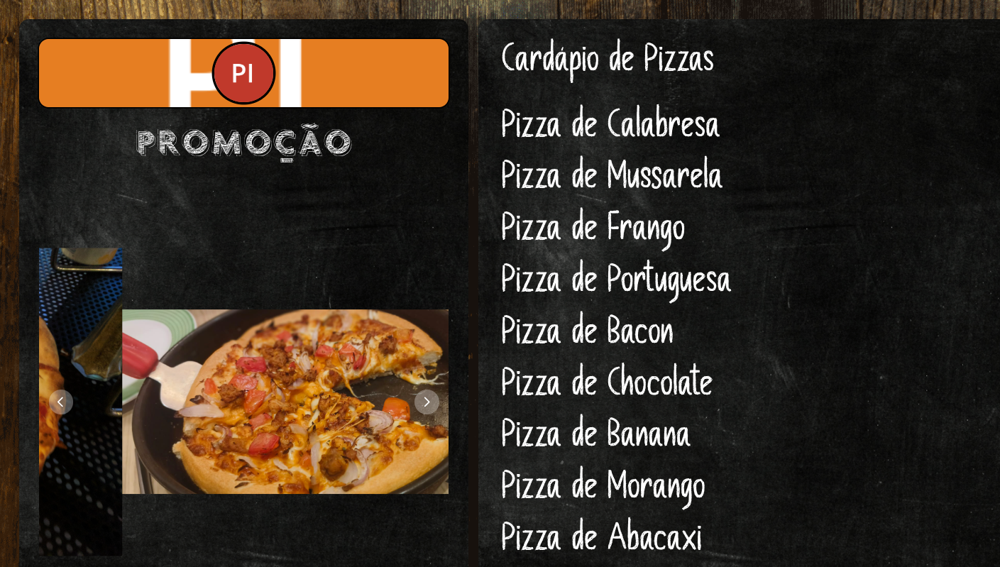
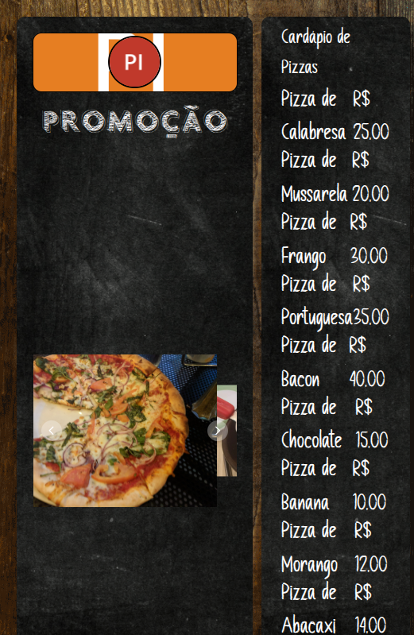

# DSPLAY - Menu Board (Featured Products) Template

A [React](https://reactjs.org/) [HTML-based template](https://developers.dsplay.tv/docs/html-templates) for the [DSPLAY - Digital Signage](https://dsplay.tv/) platform — a two-column menu board: a scrolling promo carousel + brand logo on the left, up to 10 product name/price rows on the right, styled like a chalkboard.

> Built with [Vite](https://vitejs.dev/), requires Node.js 22.22.2+, 24.15.0+, or 26+ (see `.nvmrc`).

## Supported screen formats

| Landscape | Portrait | Square |
|-----------|----------|--------|
|  |  |  |

| Horizontal banner |
|--------------------|
|  |

## Template variables

| Key                                | Type   | Description                                                    |
|-------------------------------------|--------|-------------------------------------------------------------------|
| `logo`                              | string | Brand logo, shown above the promo carousel.                      |
| `logo_banner`                       | string | Background image behind the logo.                                 |
| `promo_title`                       | string | Title above the promo carousel. Defaults to "Untitled".          |
| `promo_img_01`, `promo_img_02`, `promo_img_03` | string | Images cycled by the promo carousel.                    |
| `menu_title`                        | string | Menu board title. Defaults to "Untitled".                         |
| `prod_name01`..`prod_name10`        | string | Product name for row 1-10. Defaults to "Product 01".."Product 10". |
| `prod_price01`..`prod_price10`      | string | Product price for row 1-10. Defaults to "Price 01".."Price 10".  |

> Remember to also register these as Template Vars (same name and type) when configuring this template in the DSPLAY CMS.

## Local development

```sh
npm install
npm start
```

`public/dsplay-data.js` defines `dsplay_config`/`dsplay_media`/`dsplay_template` mock globals used only when the template isn't running inside the actual DSPLAY app. Edit it to try out different values — the DSPLAY Player App replaces it with real content at runtime.

## Packing (release build)

```sh
npm run zip
```

This builds the template with Vite, which also generates `template-variables.json` + `template-example-data.json` (via [@dsplay/template-manifest](https://www.npmjs.com/package/@dsplay/template-manifest)'s Vite plugin) — the DSPLAY CMS reads these two files to auto-detect this template's variables and seed default preview values. It then generates `template.zip`, ready to be deployed to the [DSPLAY Web Manager](https://manager.dsplay.tv/template/create).

## Test assets

To use test assets (images, videos, etc) during development, put them in the `public/test-assets` folder and reference them in `dsplay-data.js` using their relative path. `public/test-assets` is automatically excluded from the release build.

## Maintaining dependencies

Regular npm dependencies, not vendored files:

```sh
npm outdated
npm update
```

For a version outside the declared range (typically a major bump), apply it deliberately and verify `npm start`, `npm run build`, and `npm test` still work before committing.

### Commit conventions

See [AGENTS.md](AGENTS.md).

## More

To see more about DSPLAY HTML Templates, visit: https://developers.dsplay.tv/docs/html-templates
